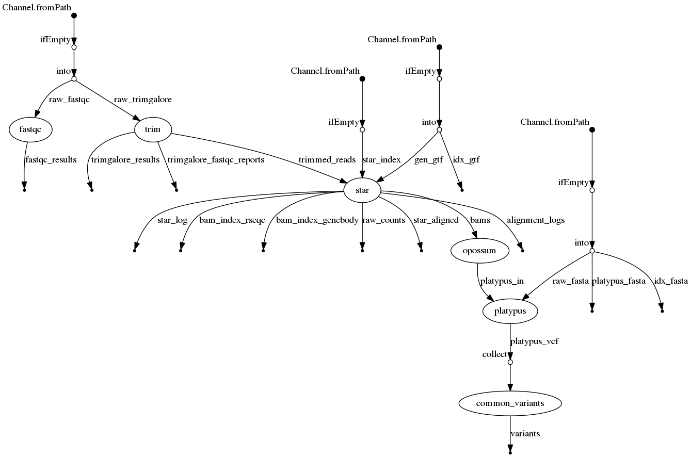

## Aims

This tool aims to provide a flexible, human interpretable indentification of neoantigens. It is designed for both
whole exome sequencing (WES) and RNA-seq data, and for human and mouse data. 

## Installation
Make sure you have Nextflow installed. It can be downloaded [here](https://www.nextflow.io/).

Clone this repository by running `git clone https://github.com/whalleyt/neoantigen_prediction`. 
Assuming you are going to run this in one of the containers supplied, then you are ready to go.

## Usage
The parameters for this pipeline can be supplied at the command line or in nextflow.config. At it's most
basic one can run:

`nextflow main.nf`

There are a number of pre-supplied profiles to be used for various executor methods and containers. These can
be accesed by the `-profile` argument. For example to run on Slurm using a singularity container run:

`nextflow main.nf -profile slurm,singularity`

## Workflow

## References
*[Nextflow](https://www.nature.com/articles/nbt.3820)

*[Trim galore!](https://www.bioinformatics.babraham.ac.uk/projects/trim_galore/)

*[FastQC](http://www.bioinformatics.babraham.ac.uk/projects/fastqc)

*[STAR](https://academic.oup.com/bioinformatics/article/29/1/15/272537)

*[Opossum](https://www.nature.com/articles/ng.3036)

*[Platypus](https://www.nature.com/articles/ng.3036)

*[arcasHLA](https://www.biorxiv.org/content/10.1101/479824v1)

## License
This code is freely available under the GNU GPL V3. Please see [LICENSE](LICENSE) for more information.

## Contact
Queries can be made to whalleyt@cardiff.ac.uk. Please feel free to flag issues on this repo, also.